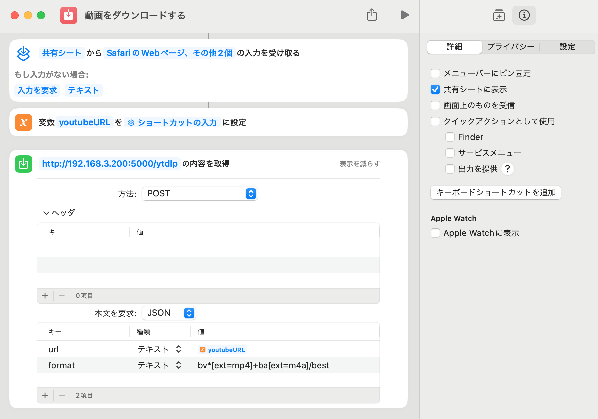

# ytdlp Server

ytdlp Sever is a API Endpoint for launch yt-dlp on your network.

## tl;dr

Prepair Ubuntu Server and run here.

```sh
sudo apt update
sudo apt install docker.io cifs-utils
sudo gpasswd --add $USER docker
newgrp docker
sudo curl -SL https://github.com/docker/compose/releases/download/v2.4.1/docker-compose-linux-x86_64 -o /usr/local/bin/docker-compose
sudo chmod +x /usr/local/bin/docker-compose
```

Customise to your environment.

```sh
sudo mkdir -p /mnt/video
sudo tee -a "//<your windows ipaddr>/<your sharing path>   /mnt/video   cifs  nofail,_netdev,x-systemd.automount,user=<your username>,password=<your password>,file_mode=0664,dir_mode=0775  0  0" /etc/fstab
sudo mount -a
```

Start Service.

```sh
docker-compose up -d --scale worker=4
```

Now you can download video by `curl -X POST "http://<Your Server IPaddr>:5000/ytdlp" -d "{\"url\": \"https://www.youtube.com/watch?v=XXXXXXXXXX\"}"`

## Setup

### Install Container engine

<!-- #### Install and setup podman

Install
```sh
sudo apt update
sudo apt install podman
```

Setup user socket for podman.
```sh
systemctl --user enable --now podman.socket
## find your Socket path
SOCKET_PATH=`systemctl --user show podman.socket --no-pager | grep Listen | sed "s/\(Listen=\)\(.*\) .*/\2/"`
## add Socket for environment
echo "export DOCKER_HOST=unix://${SOCKET_PATH}" >> ~/.bashrc
echo 'export DOCKER_BUILDKIT=0' >> ~/.bashrc
. ~/.bashrc
## add registry config to docker.io and quay.io
cat << EOF | sudo tee -a /etc/containers/registries.conf
unqualified-search-registries = ['docker.io', 'quay.io']
EOF
```

Cannot resolve this problem
```
>> docker-compose up -d
[+] Running 3/4
 ⠿ Network ytdlpserver_default     Created                                                                                                                                                0.0s
 ⠿ Container ytdlpserver-redis-1   Starting                                                                                                                                               0.2s
 ⠿ Container ytdlpserver-worker-1  Created                                                                                                                                                0.1s
 ⠿ Container ytdlpserver-api-1     Created                                                                                                                                                0.1s
Error response from daemon: error configuring network namespace for container 9b1b4da7665280232cbadcbdc268ab3e821e277b7521e48971d6d8ec31cac79c: CNI network "ytdlpserver_default" not found
```

Fail to create CNI and not work external endpoint.
-->

#### Install and setup docker

docker.io may charge a fee in the future.

```sh
sudo apt update
sudo apt install docker.io
sudo gpasswd --add $USER docker
newgrp docker
## if docker soket is down, reboot
sudo reboot
```

### Install docker compose

Launch in ubuntu 22.04 LTS.

https://matsuand.github.io/docs.docker.jp.onthefly/compose/install/

```sh
sudo curl -SL https://github.com/docker/compose/releases/download/v2.4.1/docker-compose-linux-x86_64 -o /usr/local/bin/docker-compose
sudo chmod +x /usr/local/bin/docker-compose
docker-compose --version
```

```log
ubuntu@devsv:~/git/ytdlpServer
>> docker-compose --version
Docker Compose version v2.4.1
```

### Install cifs for mount Windows Directory

Install for mount windows samba share directory.

```sh
sudo apt install cifs-utils
```

Create mout directory

```sh
sudo mkdir -p /mnt/video
```

if you need not hide your credential, you can setup `fstab` with hardcode credential.

ex. mount `¥¥192.168.3.120¥Videos`, user name is `samba`, password is `samba`. add that to `/etc/fstab`

```conf
//192.168.3.120/Videos   /mnt/video   cifs  nofail,_netdev,x-systemd.automount,user=samba,password=samba,file_mode=0664,dir_mode=0775  0  0
```

If not, create samba credential directory and credential file for connect windows share directory.

```sh
sudo mkdir -p /etc/smb-credentials/
cat << EOF | sudo tee /etc/smb-credentials/.pw
username=user
password=passwd
EOF
```

...And prevent access all user except root.

```sh
sudo chmod +600 /etc/smb-credentials/.pw
```

Edit `/etc/fstab` for mount on startup.  
ex. mount `¥¥192.168.3.120¥Videos` add...

```conf
//192.168.3.120/Videos   /mnt/video   cifs  nofail,_netdev,x-systemd.automount,credentials=/etc/smb-credentials/.pw,file_mode=0664,dir_mode=0775  0  0
```

Try mount directory.

```sh
sudo mount -a
```

## Build / Install

### Install as container

Build container image.

```sh
docker-compose build
```

Attention: Very long to build, wait a moment.

<!-- ### Install as exec // not verified

launch nuitka3 and get exe.

Install python3.11 (not 3.12, nuitka3 not support yet) on your machine.

ex: Git-bash (host install python3)

```sh
pip install -r requirements.txt
nuitka3 --standalone ./main.py
```

generete `main.exe` and launch. -->

## Launch

### Launch as container

Edit `docker-compose.yml` set your directory to `volumes` for download.

```yml
worker:
  build:
    dockerfile: ./Dockerfile.worker
  depends_on:
    - redis
  environment:
    RQ_REDIS_URL: redis://redis
  volumes:
    - /mnt/video:/download
  working_dir: /download
```

Lauch container with mounting download path.

```sh
## set scale of workers.
docker-compose up -d --scale worker=4
## show log
docker-compose logs -f
```

<!-- ### Launch as exe // not verified

1. Put exe `Downloads` dir.
2. Launch app. -->

## How to use

1. send request like:

   ```sh
   curl -X POST "http://localhost:5000/ytdlp" -d "{\"url\": "https://www.youtube.com/watch?v=XXXXXXXXXX", \"format\": \"bv*+ba/best\"}
   ```

2. wait a minute and will generate video to your directory.

To make it easy, I recommend create iOS Shortcut like that...



## API option

| option | description                                                                   |
| ------ | ----------------------------------------------------------------------------- |
| url    | video URL, input of yt-dlp                                                    |
| format | format setting, input of yt-dlp.                                              |
| origts | if this parameter defined, do not update creation timestamp to download date. |
